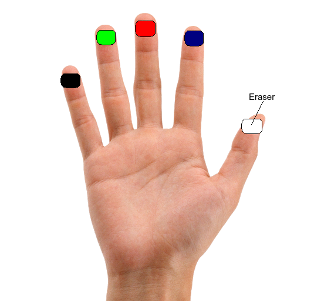

# Whiteboard application for Gesture based writing

### Run the code:
` python3 main.py `

### Libraries Used:
- Python 3.8.5
- Opencv cv2==4.5.1
- mediapipe

### Gestures Controls:
- one finger up at a time
- Index Finger = Blue \
  Middle Finger = Red \
  Ring Finger = Green \
  Pinky Finger = Black
- Thumb = Eraser
- Hand needs to be in thumbs up position while erasing

